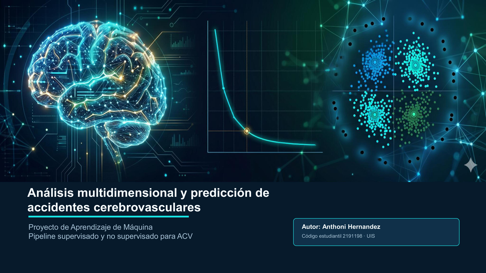

  

  # 🧠 Análisis Multidimensional y Predicción de Accidentes Cerebrovasculares (ACV)
  ### *Un Enfoque Híbrido entre Aprendizaje Supervisado y No Supervisado*

  **Autor:** Anthoni Hernandez  
  **Código Estudiantil:** 2191198  
  **Materia:** Aprendizaje de Máquina  
  **Institución:** Universidad Industrial de Santander (UIS)  

  

### 📌 Resumen del Proyecto
Este repositorio contiene el pipeline completo de Ciencia de Datos enfocado en la detección temprana y perfilamiento clínico del riesgo de accidentes cerebrovasculares (ACV / Stroke). El flujo abarca desde la limpieza de datos con análisis de impacto por imputación, escalado estadístico óptimo, modelos de clasificación basados en **Máquinas de Vector de Soporte (SVM)** con optimización de hiperparámetros, hasta la analítica avanzada no supervisada mediante **PCA**, **K-Means (Descubrimiento de Fenotipos)** y **DBSCAN (Análisis de Sensibilidad Topológica)**.

## 1. 🎯 Objetivo del Proyecto

Desarrollar e implementar un pipeline integral de Machine Learning para predecir y perfilar el riesgo de Accidentes Cerebrovasculares (ACV), contrastando la robustez de los modelos ante dos metodologías de tratamiento de datos faltantes: eliminación masiva (`DropNA`) e imputación iterativa multivariada (`Imputed`). El fin último es proveer una herramienta analítica capaz de clasificar el riesgo predictivo (Supervisado) y descubrir patrones clínicos y anomalías biológicas ocultas (No Supervisado).

---

## 2. 📊 El Dataset Utilizado

El conjunto de datos contiene registros clínicos de pacientes con variables sociodemográficas y biomédicas. La variable objetivo es `stroke` (Clasificación Binaria: 1 si el paciente sufrió un infarto, 0 si está sano). Es un entorno altamente retador debido a un **severo desbalance de clases** (~4.8% de casos positivos).

### Variables Principales:
* **Continuas:** Edad (`age`), Nivel de Glucosa Promedio (`avg_glucose_level`), Índice de Masa Corporal (`bmi`).
* **Categóricas/Binarias:** Género, Hipertensión, Enfermedades Cardíacas, Estado Civil, Tipo de Trabajo, Tipo de Residencia y Tabaquismo.

---

## 3. 📚 Marco Teórico

El desarrollo se fundamenta en los siguientes pilares del Aprendizaje de Máquina:

* **Imputación Multivariada vs DropNA:** Evalúa si la remoción de registros sesga la densidad espacial frente a la reconstrucción matemática basada en correlaciones vecinales.
* **Escalado Estadístico (StandardScaler):** Transforma las variables para que tengan media 0 y varianza 1. Es mandatorio para algoritmos basados en distancias (SVM, PCA, K-Means, DBSCAN), evitando que variables con escalas macro (ej. glucosa hasta 271) opaquen a variables micro.
* **SVM (Support Vector Machines):** Modelo supervisado que busca el hiperplano óptimo de separación. El uso de funciones de base radial (**Kernel RBF**) permite proyectar los datos a un espacio de infinitas dimensiones para trazar fronteras curvas complejas.
* **PCA (Análisis de Componentes Principales):** Técnica de reducción de dimensionalidad lineal que proyecta el espacio ortogonalmente hacia las direcciones de máxima varianza.
* **K-Means:** Algoritmo de particionamiento iterativo que minimiza la inercia intracluster (distancia euclidiana al cuadrado hacia el centroide).
* **DBSCAN:** Algoritmo de agrupamiento espacial basado en densidad. Define clusters a partir de vecindades densas (`eps` y `min_samples`) y etiqueta los puntos aislados como ruido matemático.

---

## 4. ⚙️ Metodología y Flujo de Trabajo (Pipeline)

### Fase 1: Preprocesamiento y Control de Densidad
Se segmentó la estrategia en dos líneas paralelas de análisis para comparar la resiliencia de los algoritmos:
1.  **Caso 1 (DropNA):** Eliminación estricta de valores nulos en la variable `bmi`.
2.  **Caso 2 (Imputado):** Reconstrucción de datos faltantes manteniendo la estructura correlacional.

> **Decisión Crítica:** Se seleccionó **StandardScaler** sobre MinMaxScaler. La experimentación demostró que MinMaxScaler comprimía severamente las distribuciones debido a los *outliers* de glucosa, mientras que StandardScaler preservó la morfología de las dispersiones y garantizó el correcto funcionamiento de los estimadores geométricos.

### Fase 2: Aprendizaje Supervisado (Clasificación)
Se entrenaron clasificadores SVM balanceando las cargas mediante estratificación en el particionado (`stratify`).
* **SVM Lineal:** Falló en establecer fronteras de decisión eficientes debido a la superposición biológica de los pacientes en un espacio euclidiano básico.
* **SVM Kernel RBF:** Se consagró como el modelo óptimo. Al elevar la dimensionalidad a un espacio de Hilbert, logró curvar las fronteras de decisión aislando eficientemente los casos positivos sin generar un desborde de falsos positivos.

### Fase 3: Aprendizaje No Supervisado (Analítica Avanzada)

#### A. Reducción con PCA
Se redujeron las dimensiones a 2 Componentes Principales, logrando retener el **~52.3% de la varianza total** en el Caso 1 y el **~52.2%** en el Caso 2. La visualización de PCA demostró geométricamente que las clases no son linealmente separables, justificando el uso previo del Kernel RBF.

#### B. Perfilamiento con K-Means
Evitando el error común de usar $K=2$ (diagnóstico ciego), se ejecutó el **Método del Codo (Elbow Method)** analizando la tasa de cambio de la inercia desde $K=1$ hasta $K=15$. 

La matemática demostró que el punto de inflexión óptimo es **K=4**. Esto permitió segmentar la población en **4 Fenotipos Clínicos de Riesgo** (Bajo, Moderado, Alto y Crítico) altamente accionables para la toma de decisiones hospitalarias.

#### C. Análisis de Sensibilidad Topológica con DBSCAN
DBSCAN fue implementado bajo un riguroso análisis micro y macro:
1.  Se utilizó el gráfico de **K-Distancias al 10mo vecino** para delimitar una **Zona de Transición Topológica** (Frontera amarilla: entre 1.6 y 2.2 para DropNA; entre 1.2 y 1.5 para el Caso Imputado).
2.  Se graficaron escenarios en los extremos (`Eps=0.5` macro-estricto y `Eps=5.0` macro-relajado) demostrando empíricamente su inviabilidad por sobre-segmentación de ruido o aglomeración total.
3.  Se realizó un *Fine-Tuning* micro en la frontera, seleccionando un `Eps=1.7` (Caso 1) y `Eps=1.75` (Caso 2) con `min_samples=10`, logrando estabilizar un modelo con un cuerpo denso masivo y un **0.2% de ruido clínico de alta precisión**.

---

## 5. 🏁 Conclusiones del Proyecto

1.  **Complejidad de la Patología:** Las visualizaciones de PCA y la superposición de etiquetas reales evidencian que el riesgo de ACV es un problema altamente multidimensional. Un paciente con ACV comparte rangos biométricos extensos con la población sana, haciendo invencibles a los modelos con kernels curvos (No Lineales) sobre los lineales.
2.  **Robustez de la Imputación:** Al contrastar visual y matemáticamente las topologías finales de los mapas de clusters entre el **Caso 1** y el **Caso 2**, se demostró que el proceso de imputación fue extraordinariamente limpio. No introdujo artefactos artificiales ni distorsionó las densidades espaciales del dataset original, validando el rescate de registros clínicos.
3.  **Valor del Perfilamiento Estadístico (K-Means):** Se concluye que K-Means no debe ser usado como un diagnosticador médico directo en datos altamente solapados, sino como un estratificador poblacional. El modelo con $K=4$ agrupó con éxito arquetipos de pacientes por similitud física, permitiendo una distribución inteligente de recursos médicos preventivos.
4.  **DBSCAN como Filtro de Anomalías Críticas:** La calibración milimétrica en la zona de transición demostró que DBSCAN es un localizador excepcional de *outliers* clínicos. El 0.2% de ruido aislado representa pacientes con combinaciones sindromáticas extremas (perfiles atípicos aislados de la norma biológica) que requieren de manera prioritaria intervención médica personalizada.

---

## 🛠️ Tecnologías y Librerías Utilizadas
* **Python 3.x**
* **Pandas & NumPy** (Manipulación de estructuras de datos)
* **Scikit-Learn** (Módulos de Preprocessing, SVM, KMeans, DBSCAN, PCA, Neighbors)
* **Matplotlib & Seaborn** (Visualización estática avanzada y mapas de densidad)